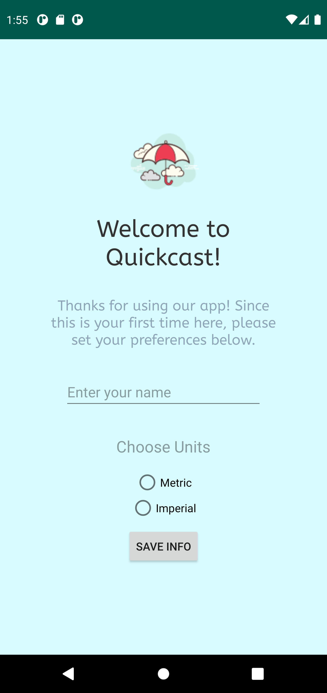
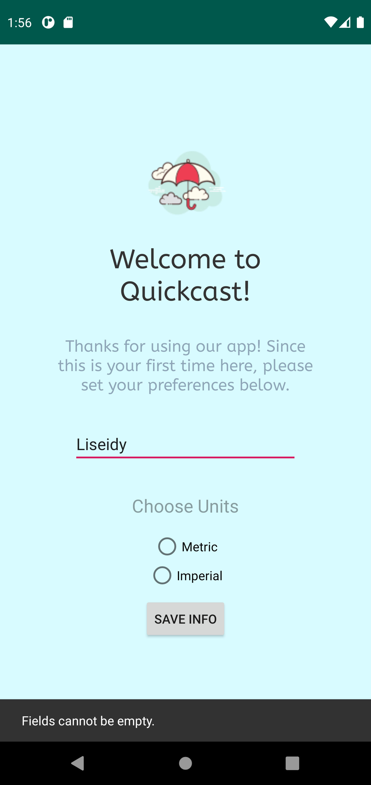
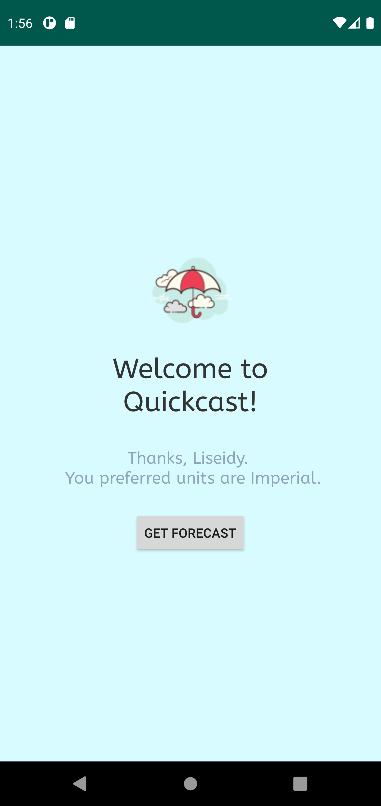
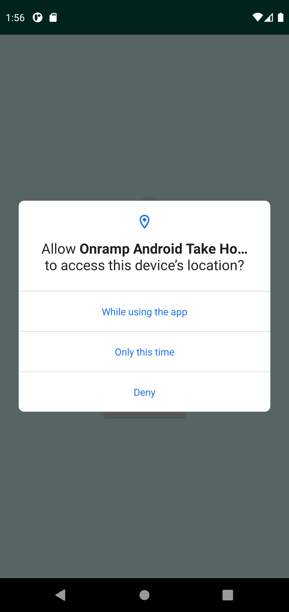
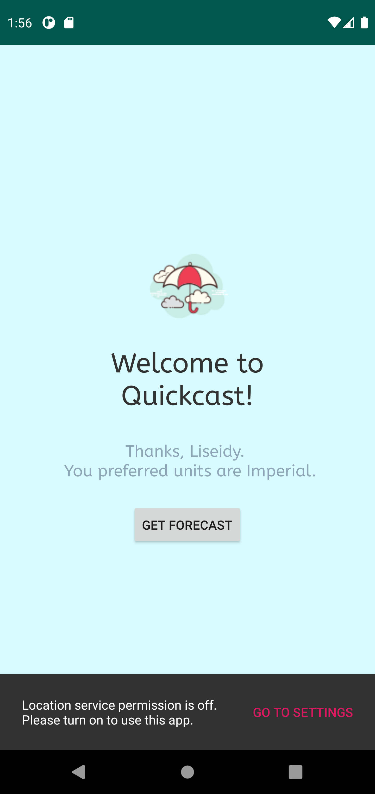
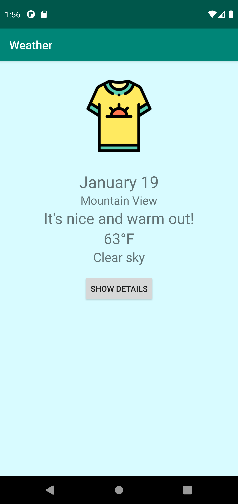
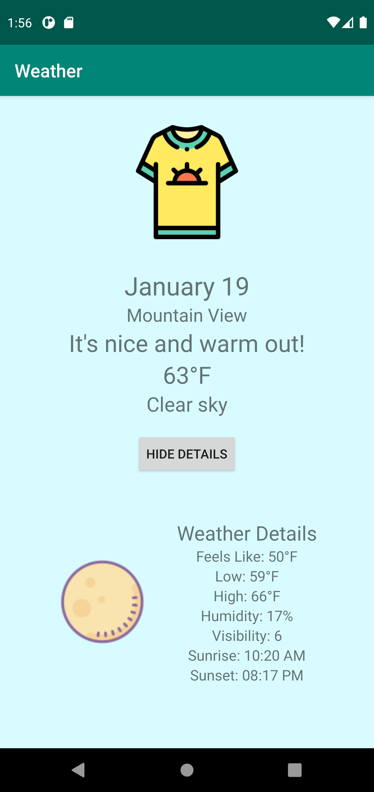
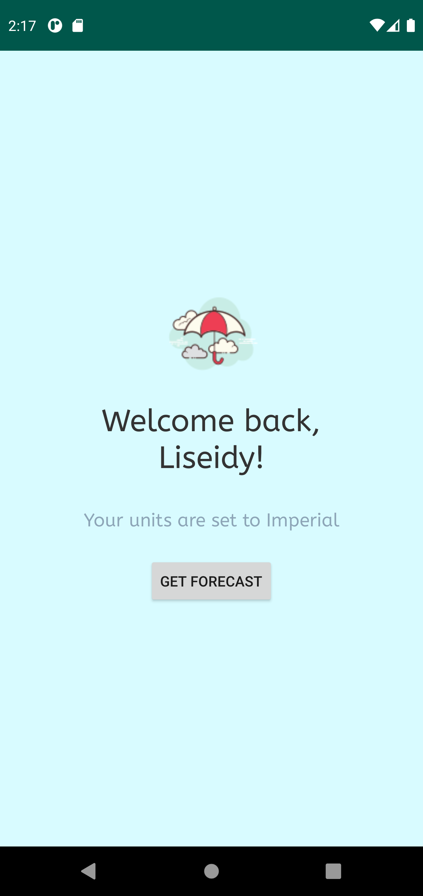

# WeatherApp on Android

## Overview

Quickcast is a weather app that allows the user to store their name and preferred units (Imperial or Metric) and get their local weather. The screen shows a very simple and straightforward message about the weather and more details are available when clicking on the "Show Details" button. 

## Description

The application uses a foreground service to get the location and OpenWeatherMap API to get current weather data for the specific location provided by the service. The application uses two activities - Main and Weather - and a fragment - Weather Details. MVP architecture is utilized for separation of concerns and Retrofit is used to make the API call. 

### Requirements Met
Activities: MainActivity & WeatherActivity
 Fragment: WeatherDetails
 Service: LocationService
 UI Elements: Snackbar, Buttons, EditText, Radio Buttons, ImageViews, Animations (slide up/down on fragment)
 API: OpenWeatherMap API via Retrofit
 Data Persistence: Store data via SharedPreferences 

#### Photos & Details 

The very first screen when the user opens the app for the first time. This screen takes in two strings - the user's name and preferred units. This is the Main Activity. This screen containts an ImageView, Radio Buttons, Text Views, and Edit Text.

If the user does not enter one of the fields, a snack bar appears letting them know they must fill out all fields.

On successful log in, the user sees a screen confirming their name and preferred units and are invited to get Forecast. Once the user clicks the button, the location service begins and permission is requested to use the user's location.

Permission is required to access user's location. 

If user denies the permission request, then a snack bar pops up to let the user know that the app will not function without the request. There is a link for the user to go to the phone's settings to change the permissions. 

Upon a successful API call and location request, the user will see a message and some weather information for their location. Conditional statements depending on the temperature and weather details will display a different message and image. 

The user has the option to get more weather details by clicking on "Show Details." The container with the fragment slides up and the button text changes to "Hide Details." Upon clicking "Hide Details", the container slides back down. A bundle sent via fragment manager and fragment transaction from the Weather Activity is used to send data from Weather Activity to Weather Details. In Weather Details, the arguments are accepted and a variable for the fragment layout is created. This variable is used to pass the variables to the Text Views in the fragment layout.

If the user has used the app before, they are taken to this screen instead of the very first screen. Here, they just have to click "Get Forecast" to get the current weather forecast. 
